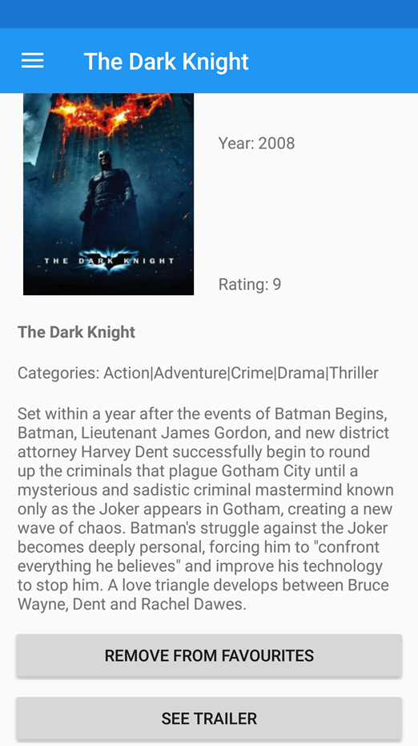
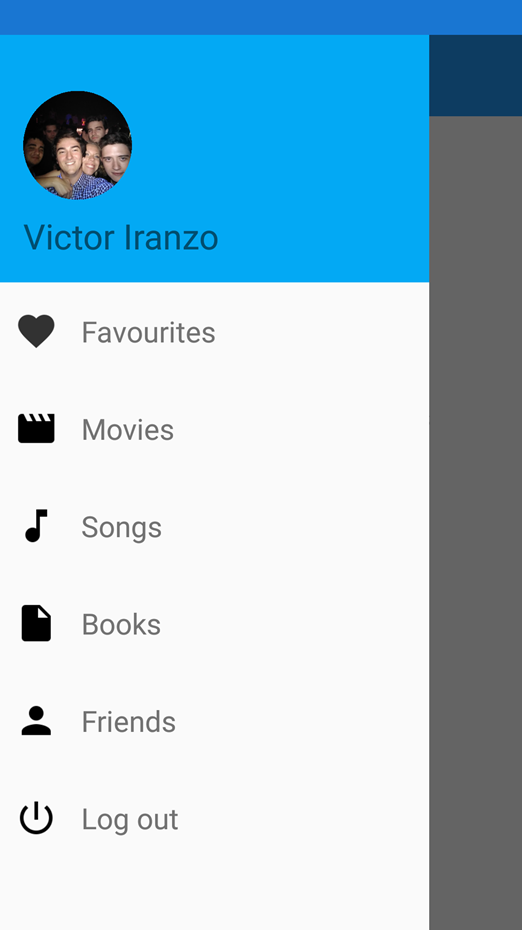
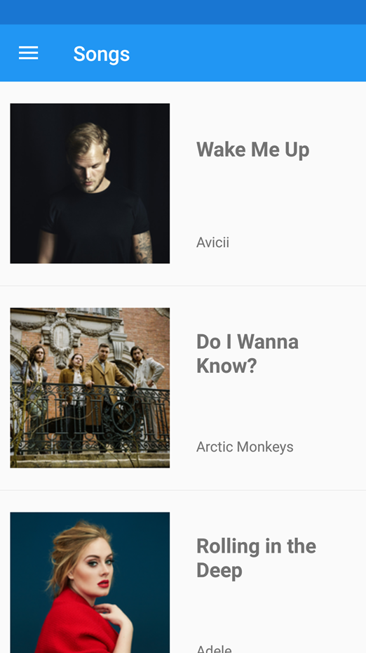
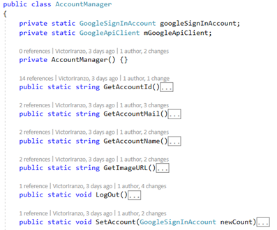
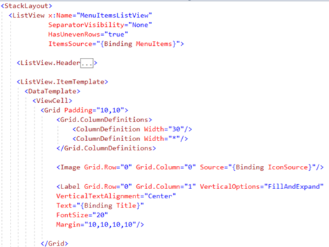
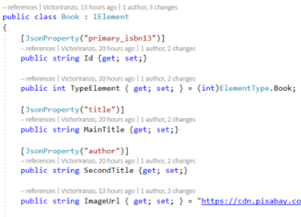
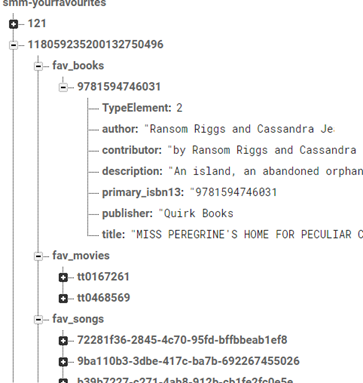
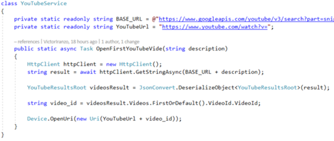

# SMM_Practice3
(Developed during the CS Degree) A Xamarin.Forms application to collect your favourite books, songs and movies and share them with your friends.

# Screenshots

# Report

##Added authorization using Google API

The classes for that purpose are specific of the Android Project. To communicate the PCL and the Android Project, a third Project must be added as otherwise an error of circular dependency will appear.

Most of the code for the authorization comes from this examples: https://causerexception.com/2017/12/03/google-native-login-with-xamarin-forms/
https://developer.xamarin.com/samples/monodroid/google-services/SigninQuickstart/

The steps to add the authorization are explained in the first link, while in the second sample code is provided. The most interesting code is located in the LoginActivity of the Android project: 

Starts the intent of the Login when the button is pressed.

If the user signs in correctly, we start the MainActivity.

The Android and PCL project need to communicate because the first one needs to send to the second the object of the Google user after sing in. This object contains the name of the user and its photo that is shown in the master detail layout. The class to communicate is the AccountManager in the AndroidAuthorization project:

## Added Master-Detail Pages

A MainPageMenuItem is defined containing the tile of an element that appears in the navigation layout and an image. A collection of this elements is passed to this layout to create the navigation layout.

Use of 3 APIs: (only GET operations are done. For the first and second an API key is required) Examples of requests: 
- Books: https://api.nytimes.com/svc/books/v3/lists.json?api-key=d08a16c185df44058553ae97b8817c93&list=combined-print-and-e-book-fiction
- Songs: http://ws.audioscrobbler.com/2.0/?method=chart.gettoptracks&api_key=b3c29d0b7ea4c5202020a19c8a3e00bb&format=json&page=1&limit=1000
- Movies: https://hydramovies.com/api-v2/?source=http://hydramovies.com/api-v2/current-Movie-Data.csv&sort=imdb_rating

Use of an interface to treat movies, songs and books in an equal way in the Favourite page: the IElement interface is used for this purpose. The Movie, Song and Book class implement this interface given to each attribute a way of serializing in terms of a JsonProperty attribute.

Not all classes give value to all the properties. Here is an example:

The properties for serializing depends on the JSON returned by the APIs. The TypeElement is a value of an enum and is constant. Also notice that all the books have the same ImageUrl.

## Method for go back to the page before

All the pages that list some elements implement the Backable interface.

When a details page is open, the constructor receives this type of interface, that represents the page from it’s being opened.

When the back button is pressed, the event is captured and the detail page of of the MasterDetail page is set to the list page (the Backable page) that opened the detail page.

## Implemented cache for the Books and Movies services

The Movies API doesn’t offer a way to retrieve the data with pages. So when the HTTP Get is done, a lot of movies are obtained. In order to avoid repeated Gets, a cache has been implemented. This cache stores the data obtained in a single Get and when a new call is done, instead of making the HTTP Get it returns the stored collection.

The same has been done for the BooksManager, but using a dictionary where the keys are the possible lists of books.

## Firebase

Use of Firebase for POST operations to save the favourite elements of a user.

A database with Firebase has been done for storing the users, friends and favourite elements of a user. In this DB the elements are obtained are written using HTTP Rest.

All the acceses to the Firebase DB are in the class FirebaseService. Instead of current POST operations, it is used the PATCH verb as the POST operation insert an extra node in the hierarchy that we don’t desired. For example, under the fav_books node of a user there are the Id of a movie as nodes, and inside of them the Book itself.

Some classes have been used as HttpClient GetAsync method doesn’t work with Firebase. This classes have been obtained from: https://www.c-sharpcorner.com/article/creating-c-sharp-wrapper-over-firebase-api-for-basic-crud/

## IncrementalListView
Use of IncrementalListView for not loading all the elements of the list at the start. https://jmillerdev.net/incremental-listview-control-and-plugin-for-xamarin-forms/

All the list pages use them. To do this, as the link provided explain an auxiliar component must be defined to retrieve the data and get elements from a collection in a “paging” way.

When we reach the end of the list, a call to CheckMoreItems is done, and if there are more items to load, a call to AddItems is done and those elements are add to the list view.

## YouTube API
Use of the YouTube API to get the video of a song: it has been used to open the YouTube video of a song. To do that, a search by the tile of the song is done and the first video found is opened:

## ImageCircle
Use of Xam.Plugins.Forms.ImageCircle for making an image circular: the provided component has been used, found in: https://github.com/jamesmontemagno/ImageCirclePlugin 

eAn Example of use is in the FriendsPage.